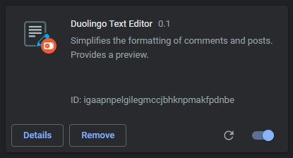

# Duolingo Text Editor

Chrome extension for duolingo.com. It simplifies the process of commenting and formatting comments.

Writing comments or posts will be easy with the Duolingo Text Editor. You no longer need to memorize a bunch of rules for formatting code.

The main features of the editor:
- Bold
- Italic
- Strikethrough
- Headers:
  - Heading 2
  - Heading 3
  - Heading 4
  - Heading 5
  - Heading 6
- Highlighted text
- Quote
- New line (100%)
- Insert horizontal line
- Create a link
- Insert an image
- Undo
- Redo
- Preview!

### How to use

##### Follow the steps to load the unpacked extension.
1. Goto Chrome Settings using three dots on the top right corner.
2. Now, Enable developer mode.
3. Click on Load Unpacked and select your Unzip folder. Note: You need to select the folder in which the manifest file exists. The folder name is `duotexteditor`.
4. The extension will be installed now.

