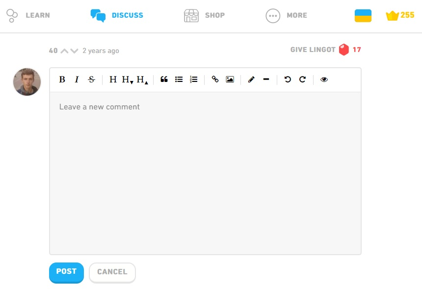
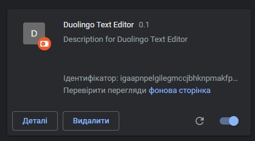

# duolingo-text-editor

Chrome extension for duolingo.com. It simplifies the process of commenting and formatting comments.

### How to use

##### Follow the steps to load the unpacked extension.
1. Goto Chrome Settings using three dots on the top right corner.
2. Now, Enable developer mode.
3. Click on Load Unpacked and select your Unzip folder. Note: You need to select the folder in which the manifest file exists.
4. The extension will be installed now.

