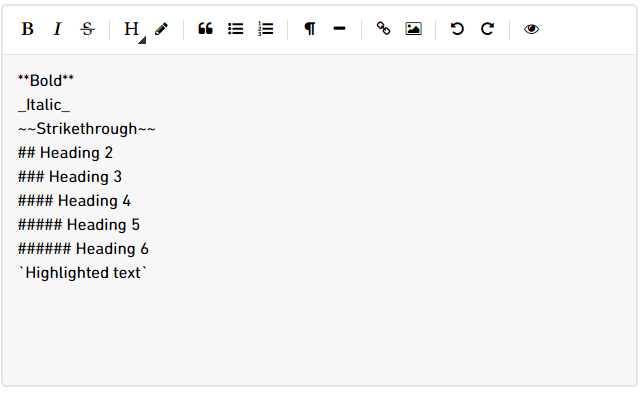
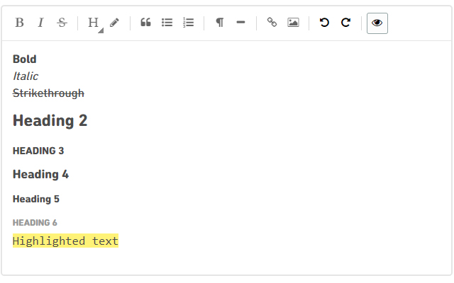
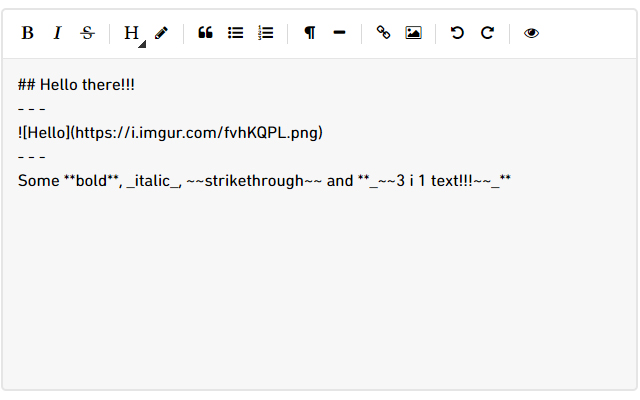
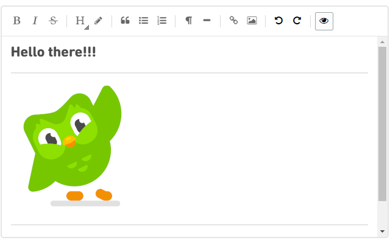
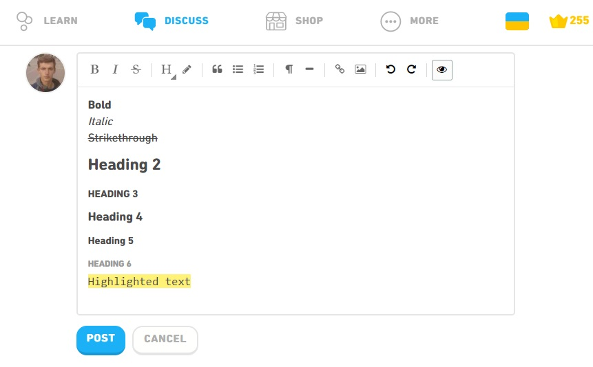

<h1>
  
  Duolingo Text Editor
</h1>

A browser extension that provides easy and fast editing and formatting of comments or posts on [Duolingo](https://forum.duolingo.com).

### Description

Writing comments or posts will be easy with the Duolingo Text Editor. You no longer need to memorize a bunch of rules for formatting code.

### Features

The main features of the editor:
- Bold
- Italic
- Strikethrough
- Headers:
  - Heading 2
  - Heading 3
  - Heading 4
  - Heading 5
  - Heading 6
- Highlighted text
- Quote
- New line (100%)
- Insert horizontal line
- Create a link
- Insert an image
- Undo
- Redo
- Preview!

### Download  

- [Chrome extension](https://chrome.google.com/webstore/detail/duolingo-text-editor/lminlegkokddakonaglakjgailkoaeak?hl=en-US)
- [Firefox add-on](https://addons.mozilla.org/en-US/firefox/addon/duolingo-text-editor/)

### Screenshots

  

- - -

  

- - - 

